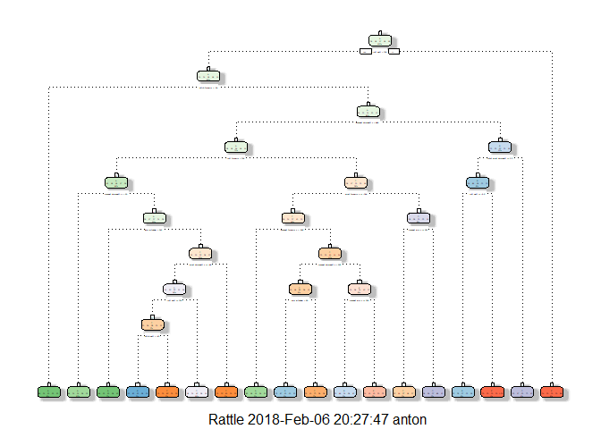

## Loading Requirements


```r
library(caret)
```

```
## Loading required package: lattice
```

```
## Loading required package: ggplot2
```

```r
library(rpart)
library(rpart.plot)
library(rattle)
```

```
## Rattle: A free graphical interface for data science with R.
## Version 5.1.0 Copyright (c) 2006-2017 Togaware Pty Ltd.
## Type 'rattle()' to shake, rattle, and roll your data.
```

```r
library(randomForest)
```

```
## randomForest 4.6-12
```

```
## Type rfNews() to see new features/changes/bug fixes.
```

```
## 
## Attaching package: 'randomForest'
```

```
## The following object is masked from 'package:rattle':
## 
##     importance
```

```
## The following object is masked from 'package:ggplot2':
## 
##     margin
```


## Executive Summary

Using devices such as Jawbone Up, Nike FuelBand, and Fitbit it is now possible to collect a large amount of data about personal activity relatively inexpensively. These type of devices are part of the quantified self movement - a group of enthusiasts who take measurements about themselves regularly to improve their health, to find patterns in their behavior, or because they are tech geeks. One thing that people regularly do is quantify how much of a particular activity they do, but they rarely quantify how well they do it. In this project, your goal will be to use data from accelerometers on the belt, forearm, arm, and dumbell of 6 participants. They were asked to perform barbell lifts correctly and incorrectly in 5 different ways. 

More information is available from the website here: http://web.archive.org/web/20161224072740/http:/groupware.les.inf.puc-rio.br/har


## Data

The training data for this project is available here: https://d396qusza40orc.cloudfront.net/predmachlearn/pml-training.csv

The test data is available here: https://d396qusza40orc.cloudfront.net/predmachlearn/pml-testing.csv


```r
# Downloading the train and test datasets
trUrl <- "http://d396qusza40orc.cloudfront.net/predmachlearn/pml-training.csv"
tUrl <- "http://d396qusza40orc.cloudfront.net/predmachlearn/pml-testing.csv"
trainData <- read.csv(url(trUrl), na.strings=c("NA","#DIV/0!",""))
testData <- read.csv(url(tUrl), na.strings=c("NA","#DIV/0!",""))

# Initial dimention of datasets, before preprocessing
dim(trainData)
```

```
## [1] 19622   160
```

```r
dim(testData)
```

```
## [1]  20 160
```


## Expectations
The outcome variable is "classe", which takes on values A, B, C, D or E. Our expected out-of-sample error should be small for the final model we select. The out-of-sample error is measured on the testing dataset.

To ensure the results are reproducible, we will set the seed value to '12345'.

We expect the dataset to contain a lot of missing values, N/As and other variables that are irrelevant to this exercise. The training dataset will need to be cleaned up in the preprocessing step below.


## Preprocessing
First step is to remove variables that have only one or very few unique values in both the training and testing datasets: 


```r
dataNZVtrain <- nearZeroVar(trainData)
dataNZVtest <- nearZeroVar(testData)
trainDataClean<-trainData[, -dataNZVtrain]
testDataClean<-testData[,-dataNZVtrain]##
dim(trainDataClean)
```

```
## [1] 19622   124
```

```r
dim(testDataClean)
```

```
## [1]  20 124
```

Next we remove variables with mostly "N/A" values in both datasets:


```r
NAtrain<- sapply(trainDataClean, function(x) mean(is.na(x))) > 0.95
trainDataClean <- trainDataClean[, NAtrain==FALSE]

NAtest<- sapply(testDataClean, function(x) mean(is.na(x))) > 0.95
testDataClean <- testDataClean[, NAtest==FALSE]

dim(trainDataClean)
```

```
## [1] 19622    59
```

```r
dim(testDataClean)
```

```
## [1] 20 59
```

Finally we remove the first four columns, as those are fields that are irrelevant to us making any prediction:


```r
finalDataTrain <- trainDataClean[, -c(1:5)]
finalDataTest <- testDataClean[, -c(1:5)]
dim(finalDataTrain)
```

```
## [1] 19622    54
```

```r
dim(finalDataTest)
```

```
## [1] 20 54
```

Having finished the preprocessing both the training and the testing datasets have 55 variables each, and 19,622 and 20 observations respectively. The next step is to partition the training set into a train/validate partitions. We will do this in 70%/30% proportion. 


```r
inTrain  <- createDataPartition(finalDataTrain$classe, p=0.7, list=FALSE)
trainSet <- finalDataTrain[inTrain, ]
validateSet  <- finalDataTrain[-inTrain, ]
```


## Predictive Modeling

We picked two models to apply to the training data and verify on the validation set. We picked one over the other based on the accuracy of the prediction, as indicated on the confusion matrix. The final model will be applied to the testing set. We first used the decision tree model and then the random forest method. 


### Decision Trees
The first model we applied to the training dataset is the decision trees model. It is arguably a better model for this type of data, as it is easy to interpret and it gives a better performance in nonlinear settings. Setting the seed to "12345" we train the model on the training data set and plot the results:


```r
set.seed(12345)
decisionTree <- rpart(classe ~ ., data=trainSet, method="class")
fancyRpartPlot(decisionTree)
```

<!-- -->

We then attempt to predict the outcomes on the validation set. The resulting confusion matrix shows the predictions, as well as the accuracy.


```r
predictionTree <- predict(decisionTree, validateSet, type = "class")
confusionMatrix(predictionTree, validateSet$classe)
```

```
## Confusion Matrix and Statistics
## 
##           Reference
## Prediction    A    B    C    D    E
##          A 1477  204   34   58   53
##          B   60  641   34   66   97
##          C   20   66  830  145   92
##          D   95  150   57  639  127
##          E   22   78   71   56  713
## 
## Overall Statistics
##                                          
##                Accuracy : 0.7307         
##                  95% CI : (0.7191, 0.742)
##     No Information Rate : 0.2845         
##     P-Value [Acc > NIR] : < 2.2e-16      
##                                          
##                   Kappa : 0.6586         
##  Mcnemar's Test P-Value : < 2.2e-16      
## 
## Statistics by Class:
## 
##                      Class: A Class: B Class: C Class: D Class: E
## Sensitivity            0.8823   0.5628   0.8090   0.6629   0.6590
## Specificity            0.9171   0.9458   0.9335   0.9128   0.9527
## Pos Pred Value         0.8089   0.7138   0.7199   0.5983   0.7585
## Neg Pred Value         0.9515   0.9001   0.9586   0.9325   0.9254
## Prevalence             0.2845   0.1935   0.1743   0.1638   0.1839
## Detection Rate         0.2510   0.1089   0.1410   0.1086   0.1212
## Detection Prevalence   0.3103   0.1526   0.1959   0.1815   0.1597
## Balanced Accuracy      0.8997   0.7543   0.8712   0.7878   0.8059
```

The prediction accuracy is 0.834, which is fairly low, leading to a high out-of-sample error of 16.6%. We move on to the next model.


### Random Forest

Random forest model is ideal for non-bionominal outcomes and large sample sizes. We train the model on the training set and test the data on the validation set.


```r
randForest <- randomForest(classe ~. , data=trainSet)
predictionForest <- predict(randForest, validateSet, type = "class")
confusionMatrix(predictionForest, validateSet$classe)
```

```
## Confusion Matrix and Statistics
## 
##           Reference
## Prediction    A    B    C    D    E
##          A 1673    0    0    0    0
##          B    0 1139    1    0    0
##          C    0    0 1024   12    0
##          D    0    0    1  952    3
##          E    1    0    0    0 1079
## 
## Overall Statistics
##                                           
##                Accuracy : 0.9969          
##                  95% CI : (0.9952, 0.9982)
##     No Information Rate : 0.2845          
##     P-Value [Acc > NIR] : < 2.2e-16       
##                                           
##                   Kappa : 0.9961          
##  Mcnemar's Test P-Value : NA              
## 
## Statistics by Class:
## 
##                      Class: A Class: B Class: C Class: D Class: E
## Sensitivity            0.9994   1.0000   0.9981   0.9876   0.9972
## Specificity            1.0000   0.9998   0.9975   0.9992   0.9998
## Pos Pred Value         1.0000   0.9991   0.9884   0.9958   0.9991
## Neg Pred Value         0.9998   1.0000   0.9996   0.9976   0.9994
## Prevalence             0.2845   0.1935   0.1743   0.1638   0.1839
## Detection Rate         0.2843   0.1935   0.1740   0.1618   0.1833
## Detection Prevalence   0.2843   0.1937   0.1760   0.1624   0.1835
## Balanced Accuracy      0.9997   0.9999   0.9978   0.9934   0.9985
```

We can see that the accruacy is 99.8%, which is very high. The out-of-sample error is low at 0.2%. This high level of accuracy does not require us to seek any other model, nor should we create a blend of several models to achieve a higher accuracy percentage.

## Conclusion

We chose the random forest model as it yields the lowest out-of-sample error of 0.2%.


```r
# Applying the prediction model to the test set
predict(randForest, newdata=finalDataTest, type="class")
```

```
##  1  2  3  4  5  6  7  8  9 10 11 12 13 14 15 16 17 18 19 20 
##  B  A  B  A  A  E  D  B  A  A  B  C  B  A  E  E  A  B  B  B 
## Levels: A B C D E
```
